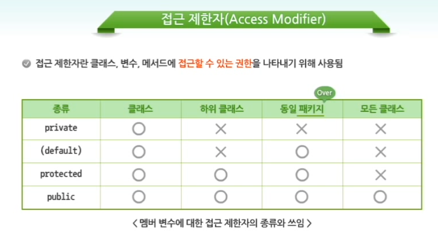

# 자바 - 객체지향

## 객체지향의 개요

- 순차적으로 실행되는 절차지향언어의 한계를 해결하기위해 등장하였다.

> - 유기적으로 연결관계를 가지고 있는 데이터들간에 관계를 설정하고 사용하기위한 방법이다.
  모듈성을 증진시키기위해 함수가 사용되어지고 함수보다 더 높은 모듈화를 위해 자신을 가지는 객체와
  객체안에 변수와 메서드등이 등장하게 되었다.
  - 객체에서 객체간 자유로운 사용이 가능해졌다.
  
  
- 정적인 요소인 변수와 동적인 요소인 메서드로 구성되어진다.

### 클래스

- 현실세계의 객체를 프로그램에서 사용할 수있는 객체로 만들기 위해서는 클래스라는 개념이 필요했다.
- 클래스란? 현실세계의 객체를 컴퓨터메모리에 생성할 수 있는 템플릿이다.
```
  //정적요소
  Class Car {
    String name;
    int speed;
    String color;
    String company;
  }
  //동적요소
  go()
  stop()
  get_price()
  
```

> - **정리하기**
> - 클래스 : 자바 응용 프로그램을 구성하는 가장 기본적인 요소로써, 메모리 상의 객체인 인스턴스를 생성하기 위한 템플릿으로 사용된다.
> - 인스턴스 : 객체가 컴퓨터 메모리에 올라간 것으로, 메모리 상의 객체를 말한다.
> - 객체 : 현실 세계에 존재하는 유.무형의 모든 것을 의미하며, 사람들이 의미를 부여하고 분류하는 논리적인 단위를 말한다.

## 객체지향 언어의 주요개념

### 상속
- 기존의 클래스를 이용해 새로운 클래스를 작성할 수 있다.
- 새로운 클래스 생성시 기존의 클래스의 메서드나 변수를 사용할 수 있게하여 중복을 최대한 제거할 수 있다.

> - 만약 공통 규정과 직군 규정이 존재할때 공통 규정에 해당하는 내용이 중복되어 있을 경우!!
> - 공통규정이 바뀐다면 각각의 규정을 모두 가져와서 수정해주어야 하는 문제점이 발생한다.
> - 이때 상속을 통해서 프로그램이 작성되어 있다면 가장 상위 클래스의 코드를 수정함으로서 빠르게 문제를 해결할 수 있다.


- **결론** : 코드를 간결하게하고 재사용성을 늘릴 수 있다.

**Car.java**
```
  public class Car{
    //멤버변수 선언
    String name;
    int currentGear;
    //멤버함수 작성
    void changeGrear(int gear){
      System.out.println("-> 기어를 " + gear + "단으로 변경");
      currentGear = gear;
    }
    String getCurrentState() {
      return name + "의 현재 기어 : " + currentGear;
    }
  }
```

**Taxi.java**
```
  //extends를 사용하여 상속받을 수 있다.
  public class Taxi extends Car{
    int fare;
    boolean passengerYn;
  }
  
```
> 상속을 받은 클래스는 부모클래스의 변수와 메서드를 사용할 수 있다.


- 상속을 위해서는 논리적인 관계가 맞아야 한다. 즉, 부모클래스와 자식클래스의 관련성이 있어야한다.

> 자바는 단일 상속만을 지원한다는 것을 알고 있자!!


### 다형성

- 하나의 인터페이스를 이욯새 서로 다른 구현을 제공한다.
> 다형성은 메서드 오버로딩과 메서드 오버라이딩을 통해 지원된다.
> **메서드 오버로딩**
> 한 클래스 안에 같은 이름의 메서드를 여러개 정의하면서, 그 인자의 개수나 유형을 다르게 해 놓은 상태
> **메서드 오버라이딩**
> 상속 관계에 있는 하위 클래스가 상위 클래스가 가지고 있는 메서드를 재정의 하는 것

### 추상화

- 구체적인 사실들을 일반화시켜 기술하는 것
- 현실세계에 존재하는 다양한 객체들의 공통된 특성을 모아 일반화해 놓는 것

### 캡슐화

- 변수와 메서드를 하나의 추상화된 클래스로 묶는 과정을 의미함

### 정보은닉

- 캡슐화된 변수나 메서드를 선택적으로 공개하거나 숨길 수 있음
- private를 이용해 정보은닉이 가능하다.

```
  public class Car{
    
    public getCurrentSpeed(){
    }
    //공개되지 않는 메서드
    private getCarModel(){
    }
  }
```

### 메시지

- 객체에서 메시지 전달을 통해 객체간에 데이터를 주고 받을 수 있다.
```
  public class carTest{
    public static void main(String[] args){
      Driver Kim = new Driver();
      kim.name = "박준영";
      
      System.out.println(kim.name + "이 운전합니다.");
      //메시지 
      kim.driving();
    }
  }
```
-----

## 클래스의 구조

> 클래스는 클래스의 선언부와 몸체로 나누어 진다.

> 1. 클래스 선언
> 2. 멤버 선언
> 3. 생성자
> 4. 메서드

1. 접근권한 예약어
- public, protected, private, (default)

> **UML개념**
> 소프트웨어 개념을 다이어그램으로 그리기 위해 사용하는 시각적 표기법
> 객체지향 프로그램을 시각화하여 보여주기 위해 사용


### 객체 생성

```
  class Car{
    String name;
    int speed;
  }

  public class oop {
    public static void main(String[] args) {
      Car Yellow = new Car();
      Yellow.name = "Lighting Yellow";
      Yellow.speed = 300;
      System.out.println(Yellow.name + " " + Yellow.speed);

      Car Red = new Car();
      Red.name = "Red";
      Red.speed = 500;
      System.out.println(Red.name + " " + Red.speed);
    }
  }
```

### 전역변수와 지역변수

- 전역변수 : 클래스 선언부 밑에 선언된 변수로 여러 메서드에서 공통으로 사용가능
- 지역변수 : 메서드 선언부 및에 선언된 변수로 해당 클래스에서만 사용가능

**접근권한**
> public : 모든 클래스에서 접근가능
> protected : 동일 패키지에 속하는 클래스와 하위 클래스 관계의 클래스에 의해 접근 가능
> private : 변수가 선언된 클래스 내에서만 접근이 가능

> **Access Modifier**


[출처] https://swexpertacademy.com
